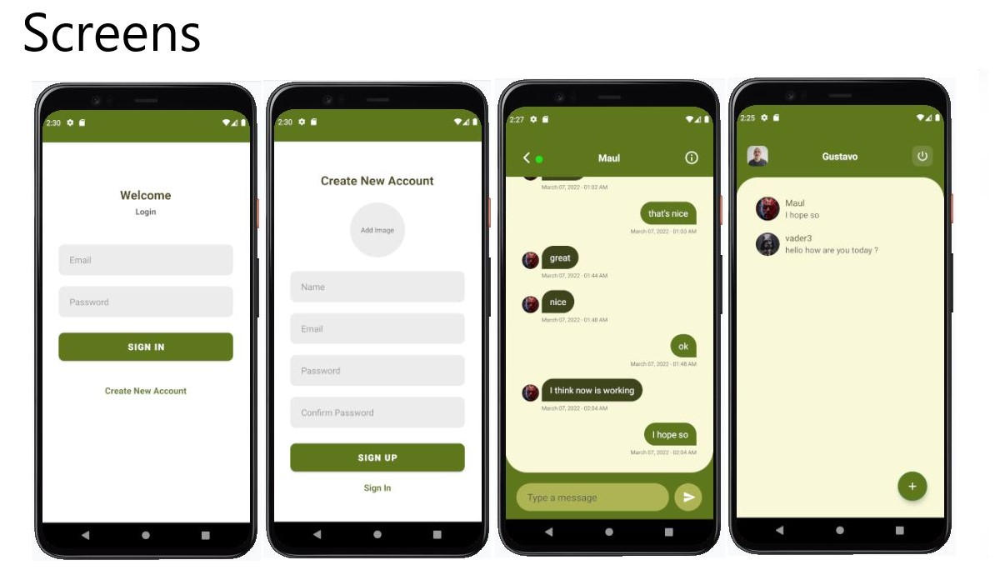
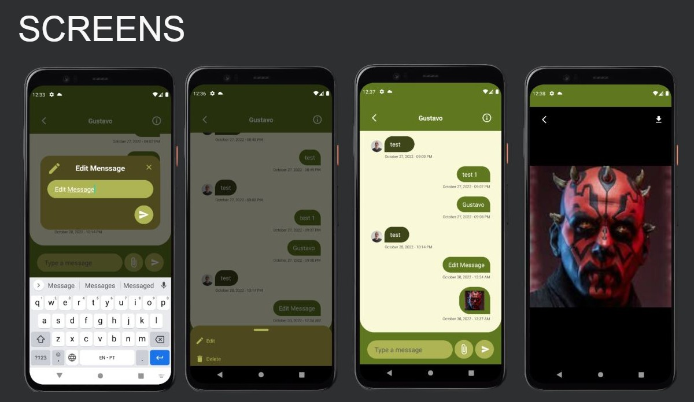

# App Chat

A few weeks ago I found an excellent tutorial on youtube made by Chirag Kachhadiya. But is entirely in Java, then with a learning purpose, I challenged myself to follow this tutorial and bring everything to Kotlin. Now I am proud of what I did. I'll continue to improve this App and add new features.

## Objective
That app is a chat app like WhatsApp we can send messages, add new users, and see recent conversations. 

## Diferencial
To store the messages I use Google Firebase and to keep the state of the user logon I use share preference.

### Tecnologias & Tools

* Kotlin
* MVVM
* Retrofit
* Shared Preferences
* Firebase

### Status: in Development

I made some improvements now we can edit messages end delete them and send pictures and we can zoom in and zoom out with finger pincers and download these pictures. Was amazing what I could learn through the process. I will continually add new features to this app feel free to give me suggestions and tips or even criticisms.

